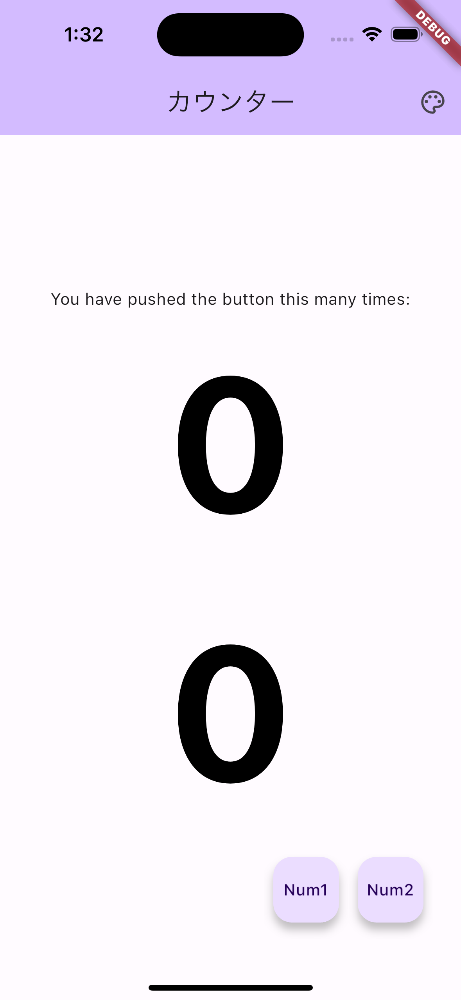
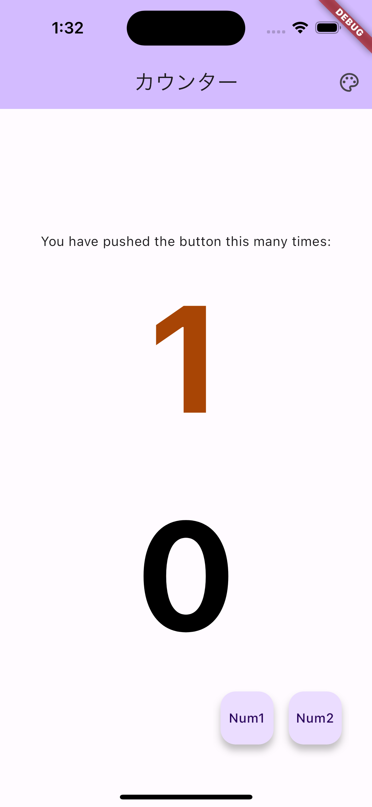
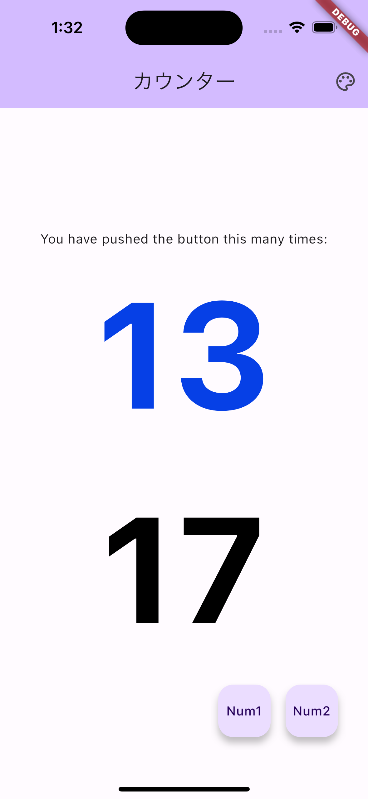

# flutter_univ_counter_provider

Flutter 大学 Provider を使った Counter アプリ

- Num1 ボタンを押すと、カウントアップと同時に色がランダムに変化します
  - [参考記事](https://qiita.com/taisei_dev/items/33a84bf27f37848b5788)
- appbar のアイコンボタンを押すと、色のみ変化します
- もうひとつ数字を表示し、Num2 ボタンを押すと select を使ってカウントアップするようにしました
  - Num1 ボタンを押すと、上の数字のみ再描画されます
  - Num2 ボタンを押すと、両方の数字が再描画されます (上の数字は watch で監視しているから)
  - [参考記事](https://zenn.dev/naoya_maeda/articles/01e51841d6fb8b)

